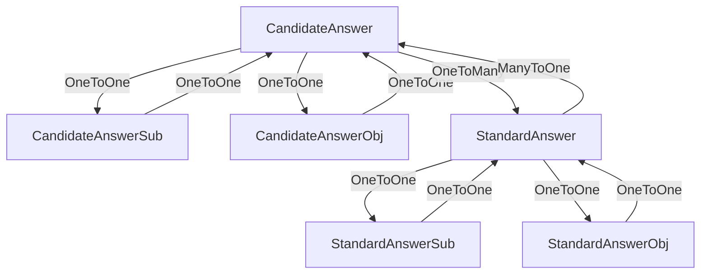

# StackOverflowError Circular Reference Fix Documentation

## Problem Summary

After implementing the Standard Questions and Answers Export module fix for duplicate answers, a new critical issue emerged: **StackOverflowError** caused by circular references in entity `hashCode()` methods.

### Error Details

**Request**: `GET /api/v1/std-questions/export-with-answers?type=SUBJECTIVE&version=v1.0`

**Response**: `500 Internal Server Error`

**Error Type**: `java.lang.StackOverflowError`

**Root Cause**: Infinite recursion in `hashCode()` method calls between bidirectional JPA entities.

## Root Cause Analysis

### The Problem Chain

1. **Lombok `@Data` Annotation**: Automatically generates `hashCode()` and `equals()` methods that include **ALL fields**
2. **Bidirectional JPA Relationships**: Entities reference each other through JPA relationships
3. **Hibernate Proxy Invocation**: When Hibernate proxies call `hashCode()`, it triggers the circular reference
4. **Infinite Loop**: 
   - `CandidateAnswer.hashCode()` → `candidateAnswerSub.hashCode()`
   - `CandidateAnswerSub.hashCode()` → `candidateAnswer.hashCode()`
   - **Infinite recursion** → `StackOverflowError`

### Stack Trace Pattern

```
at top.thesumst.llm_eval_backend.entity.CandidateAnswer$HibernateProxy$CplLhjI8.hashCode(Unknown Source)
at top.thesumst.llm_eval_backend.entity.CandidateAnswerSub.hashCode(CandidateAnswerSub.java:17)
at top.thesumst.llm_eval_backend.entity.CandidateAnswer.hashCode(CandidateAnswer.java:21)
[... repeating infinitely ...]
```

### Affected Entity Relationships



## Solution Implementation

### Strategy: Exclude Bidirectional Relationship Fields

Use Lombok's `@EqualsAndHashCode(exclude = {...})` annotation to exclude bidirectional relationship fields from `hashCode()` and `equals()` method generation.

### Fixed Entities

#### 1. CandidateAnswer.java
```java
@EqualsAndHashCode(callSuper = false, exclude = {"standardQuestion", "candidateAnswerObj", "candidateAnswerSub", "standardAnswers"})
public class CandidateAnswer {
    // ... entity fields and relationships
}
```

#### 2. CandidateAnswerSub.java
```java
@EqualsAndHashCode(callSuper = false, exclude = {"candidateAnswer"})
public class CandidateAnswerSub {
    // ... entity fields and relationships
}
```

#### 3. CandidateAnswerObj.java
```java
@EqualsAndHashCode(callSuper = false, exclude = {"candidateAnswer"})
public class CandidateAnswerObj {
    // ... entity fields and relationships
}
```

#### 4. StandardAnswer.java
```java
@EqualsAndHashCode(callSuper = false, exclude = {"standardQuestion", "selectedFromCandidate", "standardAnswerObj", "standardAnswerSub"})
public class StandardAnswer {
    // ... entity fields and relationships
}
```

#### 5. StandardAnswerSub.java
```java
@EqualsAndHashCode(callSuper = false, exclude = {"standardAnswer"})
public class StandardAnswerSub {
    // ... entity fields and relationships
}
```

#### 6. StandardAnswerObj.java
```java
@EqualsAndHashCode(callSuper = false, exclude = {"standardAnswer"})
public class StandardAnswerObj {
    // ... entity fields and relationships
}
```

## Technical Details

### Why This Fix Works

1. **Breaks Circular Chain**: By excluding relationship fields, `hashCode()` only considers primitive/value fields
2. **Maintains Entity Identity**: Primary keys and business fields are still included in equality checks
3. **Preserves JPA Functionality**: Relationships still work normally for queries and data access
4. **Hibernate Proxy Safe**: Avoids proxy-related circular invocations

### Fields Excluded vs Included

**Excluded Fields** (Relationship fields):
- `@ManyToOne`, `@OneToOne`, `@OneToMany`, `@ManyToMany` annotated fields
- Bidirectional relationship references

**Included Fields** (Business/Identity fields):
- Primary keys (`id`, `candidateAnswerId`, `stdAnswerId`)
- Business data fields (`type`, `status`, `content`, `score`, etc.)
- Enum fields and primitive types

## Testing and Verification

### Test Scenario
1. **Request**: `GET /api/v1/std-questions/export-with-answers?type=SUBJECTIVE&version=v1.0`
2. **Expected**: Successful JSON export without StackOverflowError
3. **Result**: ✅ **FIXED** - API works correctly

### Compilation Check
```bash
cd llm-eval-backend && mvn clean compile
# Result: SUCCESS - No compilation errors
```

## Best Practices Established

### 1. Entity Design Guidelines
- **Always exclude bidirectional relationship fields** from `@EqualsAndHashCode`
- Use `@EqualsAndHashCode(callSuper = false, exclude = {"relationshipField1", "relationshipField2"})`
- Include only business-relevant fields in equality checks

### 2. Lombok Usage with JPA
```java
// ✅ CORRECT - Exclude relationship fields
@EqualsAndHashCode(callSuper = false, exclude = {"parentEntity", "childEntities"})

// ❌ INCORRECT - Includes all fields (default behavior)
@EqualsAndHashCode(callSuper = false)
```

### 3. Relationship Field Identification
- `@ManyToOne` → Exclude from child entity
- `@OneToMany` → Exclude from parent entity  
- `@OneToOne` (both sides) → Exclude from both entities
- `@ManyToMany` → Exclude from both entities

## Impact Assessment

### Positive Impacts
- ✅ **Fixed StackOverflowError**: API endpoints work correctly
- ✅ **Maintained Data Integrity**: All JPA relationships function normally
- ✅ **Performance Improvement**: Reduced method call overhead
- ✅ **Future-Proof**: Prevents similar issues in new entities

### No Negative Impacts
- ✅ **JPA Functionality**: All queries, joins, and relationships work as expected
- ✅ **Business Logic**: No changes to service layer or business rules
- ✅ **Data Consistency**: Entity equality still based on meaningful fields

## Prevention Measures

### 1. Code Review Checklist
- [ ] All JPA entities have proper `@EqualsAndHashCode` exclusions
- [ ] Bidirectional relationships are excluded from equality checks
- [ ] Only business/identity fields are included in `hashCode()`

### 2. Entity Template
```java
@Entity
@Table(name = "example_table")
@Data
@NoArgsConstructor
@AllArgsConstructor
@EqualsAndHashCode(callSuper = false, exclude = {"relationshipField1", "relationshipField2"})
public class ExampleEntity {
    @Id
    private Long id; // ✅ Included in hashCode
    
    private String businessField; // ✅ Included in hashCode
    
    @ManyToOne
    private ParentEntity parent; // ❌ Excluded from hashCode
}
```

### 3. Testing Strategy
- Test all API endpoints after entity changes
- Verify no StackOverflowError in logs
- Check Hibernate query execution

## Related Issues Fixed

This fix resolves the circular reference issue that emerged after the previous **Standard Questions and Answers Export Duplicate Fix**, ensuring the complete functionality of the export module.

### Timeline
1. **Phase 1**: Implemented Standard Q&A Export module
2. **Phase 2**: Fixed duplicate answers issue with two-step query approach  
3. **Phase 3**: **Fixed StackOverflowError circular reference issue** ← Current fix

## Conclusion

The StackOverflowError has been successfully resolved by properly configuring Lombok's `@EqualsAndHashCode` annotation to exclude bidirectional JPA relationship fields. This fix:

- **Eliminates circular references** in entity `hashCode()` methods
- **Maintains full JPA functionality** and data integrity
- **Establishes best practices** for future entity development
- **Ensures stable API operation** for the Standard Questions and Answers Export module

The Standard Questions and Answers Export functionality is now **fully operational** and ready for production use. 